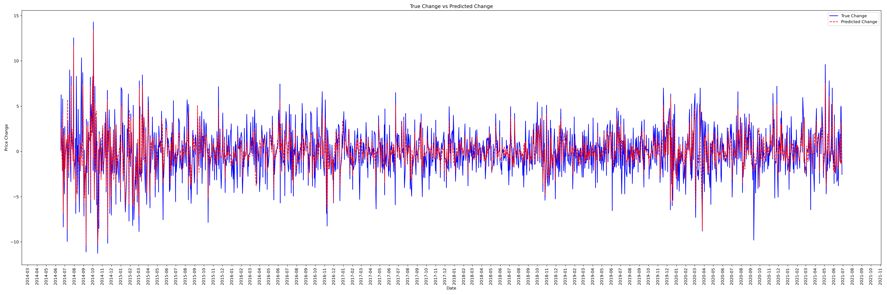
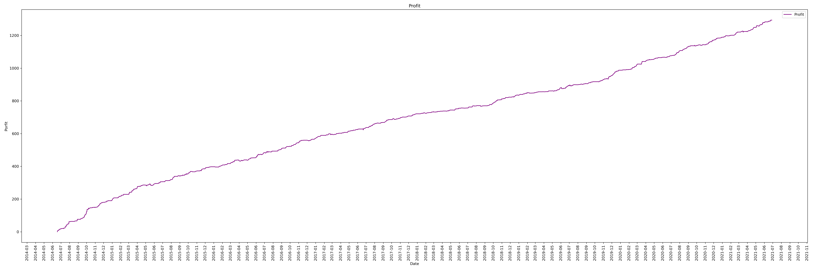

# Project Title

Data Collection and Forecasting, This is student school project, beware using it to predict stock.

# Content

-output collected data \data\all

-Commodities historical data retrieved manually from Quandl \data\commodities_historical_data\original

-Historical news articles \data\news

-Historical news sentiment scores \data\news_sentiment_scores

-Trained feature data without pca \data\trained_feature_without_pca

-Trained feature data with pca \data\trained_feature_with_pca

-All the trained model \models

-Predicted Output \predicted_output

# Requirements

To run this project you will need:

python 3.12

## Data Collection

-pandas==2.2.2

-numpy==1.26.4

-yfinance==0.2.41

-ta-lib==0.4.32

-urllib3==2.2.

-nltk==3.8.1

## Train and Evalution Prediction Model

-pandas==2.2.2

-numpy==1.26.4

-torch==2.0.1+cu124 --index-url https://download.pytorch.org/whl/cu124

-torchvision==0.15.2+cu124 --index-url https://download.pytorch.org/whl/cu124

-torchaudio==2.0.2+cu124 --index-url https://download.pytorch.org/whl/cu124

-xgboost==2.1.1

-scikit-learn==1.5.1

-optuna==4.0.0

-jalib==1.4

## Display Graph/ Tree/ Neural Network Summary and Architecture

-pandas==2.2.2

-numpy==1.26.4

-matplotlib ==3.8.4

-torch==2.0.1+cu124 --index-url https://download.pytorch.org/whl/cu124

-torchvision==0.15.2+cu124 --index-url https://download.pytorch.org/whl/cu124

-torchaudio==2.0.2+cu124 --index-url https://download.pytorch.org/whl/cu124

-xgboost==2.1.1

-torchinfo==1.8.0

-torchviz  ==0.0.2

# Flow

## Data Collection

1.Run main_data_collection.py

2.This will start the collection of historical data from Yahoo Finance. retrieve historical commodities data that was retrieved manually from Quandl, preprocess the data sets, carry out technical indicator feature enhancements, spit data sets into train and test subsets and save the data sets into their respective directories.

3.Open up commodities_news_retrieval.ipynb

4.Modify api_key, start_date, end_date and commods accordingly

5.Run notebook and this will start the collection process for news articles, take notice that there is a daily limit of 500 requests for the free tier, if the amount of data to be collected exceeds this limit, consider splitting the date range into smaller sections and run the notebook in batches for each section, remember to copy the csv file elsewhere 
before running the next batch as it will be overwritten.

6.Open up currencies_news_retrieval.ipynb

7.Modify api_key, start_date, end_date and ticker_to_currency accordingly, ticker_to_currency contains a list of ticker symbols and their respective definitions, modify ticker_to_currency based on the currency you want to retrieve news for.

8.Run notebook and this will start the collection process for news articles, take notice that there is a daily limit of 500 requests for the free tier, if the amount of data to be collected exceeds this limit, consider splitting the date range into smaller sections and run the notebook in batches for each section, remember to copy the csv file elsewhere before running the next batch as it will be overwritten.

9.Open up news_sentiment_analysis.ipynb

10.Run notebook and this will start the process of iterating through each set of historical news, tokenizing the titles, passing each word of the title through the dictionary based scoring method, aggregate and save the scores into \data\news_sentiment_scores.

## Train and Evalution Prediction Model

1. Execute main.py in code directory

# Author

Wilson Ang

Soo Kuan Yong

Clarence Ng
